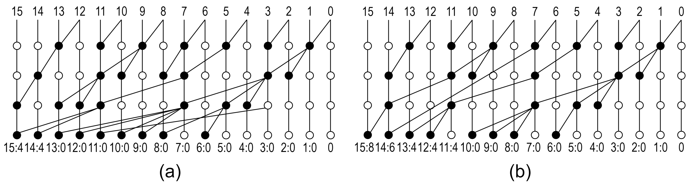
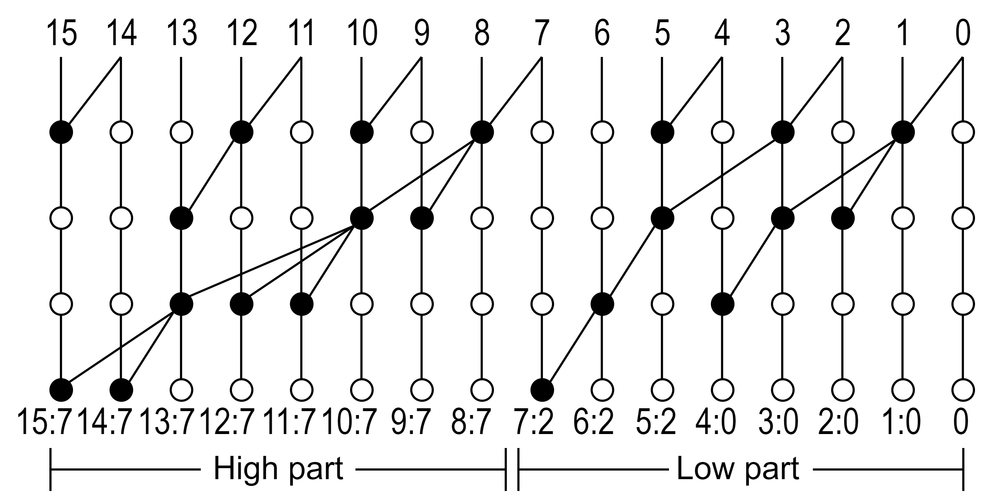

#  Synthesis of Approximate Parallel Prefix Adders

This GitHub repository contains the implementation of our method for generating approximate parallel prefix adders. The user can specify design constraints, and the method will return the Verilog implementation of a select number of the smallest adders it could generate meeting those constraints.

## Approximate Parallel Prefix Adders

When adding two $n$-bit binary numbers $A = A_{n-1}A_{n-2}\ldots A_0$ and $B = B_{n-1}B_{n-2}\ldots B_0$, the sum bit $S_i$ at the $i$-th bit position is computed by combining the modulo-2 sum (exclusive OR) of bits $A_i$ and $B_i$, i.e. $H_i = A_i \oplus B_i$ (XOR), and the carry $C_{i-1}$ computed in the previous bit position: 

$$S_i = H_i \oplus C_{i-1}$$

The carry out of the $i$-th bit position $C_i$ is computed using the local carry generate $G_i = A_i\, B_i$ (AND) and propagate bits $P_i = A_i + B_i$ (OR) and the fundamental recursive carry propagation formula: 

$$C_i  = G_{i} + P_{i} C_{i-1}$$

In **Parallel Prefix Adders** the carry computation is transformed to a prefix problem by using the associative operator $\circ$ which associates pairs of generate and propagate bits as follows:

$$(G, P) \circ (G', P') = (G + P G', P P').$$ 

Groups of carry generate and propagate terms $(G_{i:j},P_{i,j})$ are produced as follows:

$$(G_{i:j}, P_{i:j})=(G_i,P_i)\circ (G_{i-1},P_{i-1})\circ \ldots \circ (G_j,P_j)$$

Carry $C_i$ is accurate when $C_i = G_{i:0}$. On the contrary, when $C_i = G_{i:j}$ with $j > 0$, $C_{i}$ is computed inaccurately thus resulting in an approximate adder architecture. The difference $(i-j)$ defines the length of the carry chain for each bit position of the adder. 

The method generates a variety of approximate parallel prefix adders, based on a set of constraints that refer to the size of the adder, the minimum carry chain length, the number of logic levels and the maximum fanout of each operator. The example of Figure 1(a) is an approximate parallel prefix adder with a minimum carry chain constraint of 11. For completeness, the constraints that result in the generation of this adder are:

- Number of bits (adder size): 16
- Minimum carry chain length: 11
- Logic levels: 4
- Fanout: 4

Selecting a different minimum carry chain length constrains. i.e. Minimum carry chain length 8, the solution  of Figure 1(b) gets generated.

<p align="center">
    

<p align = "center">
    <b>Figure 1:</b> Adder solutions with the minimum number of operators for a minimum carry chain constraints of (a) 11 and (b) 8.
</p>


The proposed method can generate a variety of different adders by carefully selecting the constraints. In addition, for the same constraints the method can produce multiple different solutions by defining the number of adders to be generated.

### Split Accuracy

The method can also generate parallel prefix adders of **Split Accuracy**, meaning that the adder is broken down into two independent parts that do not share any operator. Each part is characterized by its own *minimum carry chain length* requirement, while both parts share the same constraints with respect to the *maximum number of prefix levels* and *fanout*.

Figure 2 shows an example of a split-accuracy parallel prefix adder that has a low part of 8 bits and a high part of 8 bits. The high part is accurate in respect to the carry in of bit 7, while bits 5-7 of the low part are inaccurate. The example adder was generated through the following constraints:

- Number of bits (adder size): 16
- Split position: 7
- Low part minimum carry chain length: 4
- High part minimum carry chain length: 9
- Logic levels: 4
- Fanout: 3

<p align="center">
    


<p align = "center">
    <b>Figure 2:</b> A split-accuracy parallel prefix adder with 8 bit accurate high part and 8 bit inaccurate low part.
</p>


## Compilation

```
g++ -O3 PrefixAdder.hpp adder_gen.cpp -o adder_gen
```

## Usage

To use the executable after compiling, pass the following command line arguments in that order based on the configuration you want to run:

1. For the base algorithm:

	- Number of bits of the adder

	- Minimum carry chain length

	- Maximum logic levels

	- Maximum fanout

	- Number of solutions to report and generate verilog for

	- Name of the files generated

2. For the split accuracy version of the algorithm:
	- Number of bits of the adder
	
	- Bit where the adder will be split
	
	- Minimum carry chain length for the low order part

	- Minimum carry chain length for the high order part

	- Maximum logic levels

	- Maximum fanout

	- Number of solutions to report and generate verilog for

	- Name of the files generated

After execution, the information for the smallest adders found will be reported in a .csv file, and the verilog for the same adders will be written in the .sv files.

For example, if we want to generate 16 bit adders, with 11 minimum carry chain, 4 logic levels, maximum fanout of 5, report the 10 smallest solutions and store them in files named approx_adder, we would execute the following command:

```
./adder_gen 16 11 4 5 10 approx_adder
```

The output of the console would be the following:

```
Generating csv file...
Wrote results in approx_adder_report.csv
Generating verilog files...
Wrote verilog files in approx_adder_x.sv
elapsed time: 10.0622s
```

The verilog of the 10 smallest adders will be generated in the files ``approx_adder_0.sv``, ``approx_adder_1.sv`` ... ``approx_adder_9.sv``.

The characteristics of those 10 adders can be found in ``approx_adder_report.csv`` which will have contents similar to this:

```
adder,level,min-carry-chain,max-carry-chain,max-fanout,#operators,EF-uniform,MRE-uniform,EF-mixed,MRE-mixed

approx_adder_0, 4, 11, 14, 5, 29, 0.00018, 0.930567, 0.00436, 44.6853
approx_adder_1, 4, 11, 14, 5, 30, 0.00012, 0.404199, 0.00456, 44.5068
approx_adder_2, 4, 11, 14, 5, 30, 0.00022, 0.876494, 0.00466, 47.1325
approx_adder_3, 4, 11, 14, 5, 30, 0.00022, 1.20617,  0.00398, 38.2297
approx_adder_4, 4, 11, 14, 5, 30, 0.00026, 2.31022,  0.00402, 39.8364
approx_adder_5, 4, 11, 14, 5, 30, 0.0002,  1.10821,  0.00454, 39.1604
approx_adder_6, 4, 11, 14, 4, 30, 0.00032, 0.897359, 0.00422, 42.9969
approx_adder_7, 4, 11, 14, 5, 30, 0.00026, 0.944931, 0.00414, 33.179
approx_adder_8, 4, 11, 14, 4, 30, 0.00016, 0.869696, 0.00448, 43.6284
approx_adder_9, 4, 11, 14, 4, 30, 0.00024, 1.29388,  0.00466, 48.6266
```

Similarly, to generate a 16bit adder with split accuracy at the 8th bit (split position 7), minimum carry chain length for the low and the high part 4 and 9 respectively, 4 logic levels and fanout 3, we would execute the following command:

```
./adder_gen 16 7 4 9 4 3 1 approx_adder
```

The output of the console would be the following:

```
Generating csv file...
Wrote results in approx_adder_report.csv
Generating verilog files...
Wrote verilog files in approx_adder_x.sv
elapsed time: 2.75795s
```

The Verilog of the smallest adder will be generated in the file ``approx_adder_0.sv``.

The characteristics of this adder can be found in the ``approx_adder_report.csv``.  In this case, the report contains information about the carry chains on each part of the adder as well as the split bit position.

```
adder,level,split-position,min-carry-chain-low,max-carry-chain-low,min-carry-chain-high,max-carry-chain-high,max-fanout,#operators,EF-uniform,MRE-uniform,EF-mixed,MRE-mixed

approx_adder_0, 4, 7, 4, 6, 9, 9, 3, 21, 0.14368, 0.0815648, 0.14182, 1.10282
```

# 

# Reference

This work has been accepted for publication in IEEE Transactions on VLSI Systems in June 2023. You can find the paper [here](https://gdimitrak.github.io/papers/TVLSI23_synthesis_approximate_prefix_adders.pdf). To cite this work, please use:

```
@article{synthApprox,
  author={Stefanidis, Apostolos and Zoumpoulidou, Ioanna and Filippas, Dionysios and Dimitrakopoulos, Giorgos and Sirakoulis, Georgios Ch.},
  journal={IEEE Transactions on Very Large Scale Integration (VLSI) Systems}, 
  title={Synthesis of Approximate Parallel-Prefix Adders}, 
  year={2023},
  volume={},
  number={},
  pages={1-14},
  doi={10.1109/TVLSI.2023.3287631}}

```

## Contributors

Currently active: [Dionysios Filippas](https://github.com/dionisisfil) and [Giorgos Dimitrakopoulos](https://github.com/gdimitrak)

Past: Apostolos Stefanidis and Ioanna Zoumpoulidou

## License

This work is licensed with the MIT License. You are completely free to re-distribute your work derived from this method.
